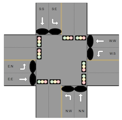

# TrafficLightController

TrafficLightController is an application to optimize the throughput of a four-way intersection.



The controller cycles through these patterns. Each pattern has a minimum and maximum active time.
  1. North & South Turning Traffic
  2. North & South Through Traffic
  3. East & West Turning Traffic
  4. East & West Through Traffic

The controller is optimized in multiple ways:
  1. A pattern stays green as long as the opposing lanes are clear of vehicles
  2. Pattern advances when cars awaiting at red lights and the minimum active time is hit for the current pattern
  3. Automatically transitions between GREEN and RED

## Application Folder Structure

```txt
├── external ///< external dependencies for this repo
│   ├── googletest
│   └── openSpaceToolkitCore
├── inc
│   ├── impl ///< headers of derived classes
│   │   ├── app
│   │   ├── clock
│   │   └── simulator
│   └── interfaces ///< headers of pure virtual classes
│       ├── app
│       ├── clock
│       └── simulator
├── src ///< source of derived classes
│   ├── app
│   ├── clock
│   └── simulator
└── test
│   ├── mocks ///< mocks of pure virtual classes
│   └── tests ///< unit tests
```
**Note**: Markdown structure generated via tree command. [See tree man page for help](https://linux.die.net/man/1/tree)

## Getting Started

### Add SSH Keys

Generate new public & private key pair. Copy public key from $HOME/.ssh/id_rsa.pub and paste into new SSH key in Github Account Settings.
```bash
ssh-keygen -t rsa -b 4096
```

### Clone Repo

```bash
git clone --recursive git@github.com:Nrockwood/TrafficLightController.git
```

## Setup

### Docker Development Environment

Using [Docker](https://www.docker.com) for development and testing is recommended. The included .devcontainer already has a Docker Container available for usage.

Pull and use the available Docker Container from .devcontainer with:
```bash
make docker-run
```

### Non-Docker Development Environment

If Docker is not available to use, then install this list of [Dependencies](#dependencies) on your target system.

### Build

Build the app with
```bash
make build
```

### Run

Run the app with
```bash
make build run
```

### Test

Run the tests with
```bash
make build test
```

### Dev

To see a list of commonly used tasks you may use during development of this project run
```bash
make
```

## Dependencies

| Name                    | Version    | License      | Link                                                                   |
| -----------             | --------   | ------------ | ---------------------------------------------------------------------- |
| git                     | >=`2.39.3` | GPL-2.0-only | [git-scm.com/downloads](https://git-scm.com/downloads)                 |
| cmake                   | >=`3.5.0`  | BSD-3-Clause | [cmake.org/download](https://cmake.org/download)                       |
| make                    | >=`4.2.1`  | GNU GPL      | [gnu.org/software/make/#download](https://www.gnu.org/software/make/#download)                                                                                                                     |
| python                  | >=`3.6.8`  | PSFL         | [python.org/downloads](https://www.python.org/downloads)               |

## Special Thanks

Loft Orbital, thank you for your review and consideration!

[](https://www.loftorbital.com/)

## Future Modifications

1. Reflect any feedback from peer review.
2. Utilize OpenSpaceToolkitCore libraries, such as Types, Containers, Logger, and Error.
3. Move util methods in TrafficLightController to standalone util functions.

## License

[Apache-2.0 License](TODO)